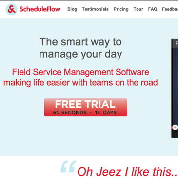



<h3 class="hello-header">Hello, my name is Art Skvira</h3>

    I am a Web and Mobile developer based in Melbourne, Australia.
    My burning passion is to help businesses and people to achieve their goals.

<h3>Highlights</h3>

    

    Developed an <em><strong>Internet Banking App</strong></em> for my client, enabling
    them to service a <em><strong>growing customer base</strong></em> on an emerging mobile platform, 
    increasing the overall appeal of the products and services being offered.
    

    

    Helped a client to <em><strong>migrate a large database</strong></em> of their existing users to a
    newly developed website, ensuring data integrity and consistency. Successfully 
    <em><strong>minimised the downtime</strong></em> and ensured smooth delivery.
    

    

    Delivered a proof-of-concept solution that had confirmed a business case for 
    the <em><strong>significant reduction of operations costs</strong></em> of my client's call centre.
    

    

    Enabled a client to <em><strong>attract a large customer base</strong></em> by creating an appealing
    set of online profile management/professional networking tools.
    

    

    Helped a client to develop a <em><strong>mobile solution</strong></em> for its corporate clients,
    thus enable them to provide a better service to existing customers as well 
    as to <em><strong>acquire new customers</strong></em>.
    

    

    Upgraded legacy invoicing system for a client, ensuring there is <em><strong>no
    interruption in invoicing and billing</strong></em> during the upgrade and support periods.
    

<h3>My Work</h3>

<ul id="contact" class="thumbnails">
  <li class="span3">
    
  </li>
  <li class="span3">
    
  </li>
  <li class="span3">
    
  </li>
  <li class="span3">
    
  </li>
</ul>

<!-- Projects modal -->

    

        

            <h3 id="projectName">ANZ Cash Management App</h3>
            

                <button class="btn btn-small btn-primary prev"><i class="icon-arrow-left icon-white">&nbsp;</i></button>                    
                <button class="btn btn-small btn-primary next"><i class="icon-arrow-right icon-white">&nbsp;</i></button>
            

        

    

    

        

            
ANZ Cash management is an internet banking platform for bank's corporate clients, that 
            simplifies wide range of operations, such as wire transfers, currency trading and payroll management.

            
            
I developed a cross-platform app that enabled ANZ to deliver banking functionality to different mobile platforms.
            This helped to increase speed to market by avoiding platform-specific implementations. 
            It also reduced maintenance and deployment costs significantly.

            
The app was build using HTML5/CSS3 and Javascript, with aid of Sencha Touch framework.
            Server side was implemented in Java, using Spring, Hibernate, Apache, MySql/Oracle.

        
        

        

            

                

                    
                                        
                

            
            
        

    

<!-- Projects modal -->

    

        

            <h3 id="projectName">Internet Banking App for NAB</h3>
            

                <button class="btn btn-small btn-primary prev"><i class="icon-arrow-left icon-white">&nbsp;</i></button>
                <button class="btn btn-small btn-primary next"><i class="icon-arrow-right icon-white">&nbsp;</i></button>
            

        

    

    

        

            
NAB was getting quite a large number of requests from its clients for a Windows Phone app to be developed.
            I assisted them in development of this app, ensuring that it matches usability and robustness of the existing iOS/Android apps.

            
Strong emphasis was put on integration with existing API to enable secure, quick and seamless Internet Banking experience for its users.

            
The app was built using C#, Silverlight, Windows Phone 7, Ajax/Json.

        

        

            

                

                    
                    
                    
                    
                    
                    
                    
                    
                

            

        

    

<!-- Projects modal -->

    

        

            <h3 id="projectName">SEEK</h3>
            

                <button class="btn btn-small btn-primary prev"><i class="icon-arrow-left icon-white">&nbsp;</i></button>
                <button class="btn btn-small btn-primary next"><i class="icon-arrow-right icon-white">&nbsp;</i></button>
            

        

    

    

        

            
Seek is a leading job board in Australia with hundreds of thousands users visiting the site every day. I participated in a number of key projects for the business, ranging from massive data transformation initiatives to front-end user experience improvements.

            
My involvement helped business to achieve target delivery dates, minimise the website's downtime during deployment periods as well as to ensure no interruption in invoicing/billing cycles.

            
Technologies used: C#, .NET, ASP.NET, MVC.NET, SQL Server, HTML/CSS, Javascript

        

        

            

                

                    
                

            

        

    

<!-- Projects modal -->

    

        

            <h3 id="projectName">Scheduleflow</h3>
            

                <button class="btn btn-small btn-primary prev"><i class="icon-arrow-left icon-white">&nbsp;</i></button>
                <button class="btn btn-small btn-primary next"><i class="icon-arrow-right icon-white">&nbsp;</i></button>
            

        

    

    

        

           
Scheduleflow is a Software as a Service product, that helps small and medium business to organise their day, manage relationship with clients and achieve higher utilisation of their time.

           
I was involved as a technical developer from the very early days, helping the business to select right technologies and tools to ensure rapid delivery and iteration, as well as carrying out major software design and development work.

           
I implemented a number of development and deployment processes to ensure high quality of the product, as well as quick pace of iteration. This enabled the business to arrive at the working revenue model, minimising the expenditures.

           
The solution was built using Python, Django, JavaScript, HTML/CSS, Postgresql

        

        

            

                

                    
                

            

        

    

<h3>Let's Talk</h3>

    

        
Have you got a new project coming up? Drop me a line and we will discuss it.

        Email me at <a href="mailto:art@nimblegecko.com" data-ga-category="Links" data-ga-action="Contact" data-ga-label="email">art@nimblegecko.com</a> or simply click "Contact me" button.
    

    

        

            

                Fill out my <a href="http://nimblegecko.wufoo.com/forms/z7x3p9">online form</a>.
            

            
        

        <a id="btnContact" class="btn btn-primary btn-large btn-block" 
           data-ga-category="Links" data-ga-action="Contact" data-ga-label="Contact Form"
           href="#divContact">Contact me</a>
        
    

###What my clients say
<blockquote>
    

    Art has been instrumental in the early days of Scheduleflow. His expertise 
    and hands-on involvement enabled us to iterate rapidly, build and deliver 
    what our target market needed.
    <a class="more" data-ga-category="Links" data-ga-action="Testimonial" data-ga-label="Paul">more...</a>
    
     Art demonstrated his insight into development practices, by implementing 
    streamlined development processes, allowing us to deliver features rapidly 
    and to a very high level of quality. This meant we had dramatically reduced 
    delivery timelines and minimal physical testing.
     
    Art is one of the most intelligent and broadly skilled senior developer I 
    have worked with. I recommend him whole heartedly and would work with him 
    again in a nano second.
    
    

    <small><cite>Paul Tyrrel, CEO, <a target="_blank" href="http://scheduleflow.com">scheduleflow.com</a></cite></small>
</blockquote>
<blockquote>
    

    Art ranks amongst the best web developers I have worked with. He has the rare combination
    of strong technical skills, people skills and a good awareness of the larger business challenges.
    <a class="more" data-ga-category="Links" data-ga-action="Testimonial" data-ga-label="David">more...</a>
    He is always proactive with his research and contributions to the rest of the team. I recommend
    Art thoroughly to any prospective employer and would happily work with him on any future engagements.
    

    <small><cite>David Hodgman, Business Analyst, <a target="_blank" href="http://linkme.com.au">linkme.com.au</a></cite></small>
</blockquote>
<blockquote>
    

    Art is an extremely talented developer with a passion to do things better. Art was always willing to tackle the 
    problems others would hate. Never scared to refactor the most complex code.
    <a class="more" data-ga-category="Links" data-ga-action="Testimonials" data-ga-label="Alan">more...</a>
    The quality of his work and attention to detail was a great asset to SEEK during some really challenging and complex projects.
    

    <small><cite>Alan Mastrantoni, Solutions Lead, <a target="_blank" href="http://www.seek.com.au">seek.com.au</a></cite></small>
</blockquote>
<blockquote>
    

    Art is a highly skilled and highly motivated developer. He has an excellent grasp of software architecture and .net technologies.
    His skills combined with his enthusiasm for software development make him a valuable asset to any team.
    <a class="more" data-ga-category="Links" data-ga-action="Testimonials" data-ga-label="Andrew">more...</a>
    He is definitely one of the best developers I have worked with.
    

    <small id="contact"><cite>Andrew Harvey, Senior Developer, Department of Education, Victoria</cite></small>
</blockquote>

<h3>My Experience</h3>

- 10+ years of experience in Web, Mobile and Database development
- Reverse-engineering and dealing with legacy codebases
- Architecture, Design Patterns, Code Review/Refactoring, Continuous Integration, Test-Driven Development
- Thorough experience in Object-Oriented Programming and Design and Functional Programming
- Hands-on experience in SDLC, Agile / Extreme Programming
- User Experience and Interface Design

<h3>Skills</h3>

<dl class="skills">
        <dt>Languages</dt>
        <dd>C#, JavaScript, Python, Objective C, Java</dd>

        <dt>Web Development</dt>
        <dd>.NET  1.1-4.0, Ajax, REST, Web Services 
        jQuery/Sencha Touch/Prototype, HTML5/CSS3 
        MVC.NET, ASP.NET, Silverlight, Django, node.js</dd>

        <dt>Frameworks/Mobile</dt>
        <dd>AWS / EC2, J2EE 
        Django, node.js 
        iOS, Windows Phone 7</dd>

        <dt>Database / Modelling</dt>
        <dd>SQL Server, Oracle, PostgreSQL, MySql, MongoDB 
        T-SQL, PL/SQL, LINQ, UML, XML/XSL, XPath 
        Hibernate/NHibernate, ADO.NET, Spring.NET</dd>

        <dt>Toolset</dt>
        <dd>Visual Studio .NET 2003/05/08/10, Eclipse, XCode, AppCode 
        Enterprise Architect, TeamCity, Jenkins, NUnit/JUnit, NUnitAsp 
        TFS, SVN, CVS, Git, Mercurial</dd>
</dl>

###Social

    

        
        <a target="_blank" href="http://au.linkedin.com/in/skvira/">LinkedIn Profile</a>
    

    

        
        <a target="_blank" href="https://github.com/ArtS">ArtS on Github</a>
    

    

        
        <a target="_blank" href="http://stackoverflow.com/users/62194/art">Stackoverflow profile</a>
    

